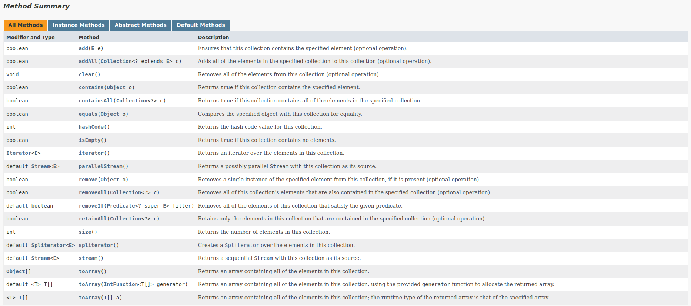

<h1>Collection Framework API</h1>

<li>Uma coleção (collection) é uma estrutura de dados que serve para agrupar muitos elementos em uma única unidade, estes elementos precisão ser Objetos.</li>
<li>Uma Collection pode ter coleções homogêneas e heterogêneas, normalmente utilizamos coleções homogêneas de um tipo especifico.</li>
<li>O núcleo principal das coleções é formado pelas interfaces da figura a abaixo, essas interfaces permitem manipular a coleção independente do nível de detalhe que elas representam.</li>
<li>Temos quatro grandes tipos de coleções: List (lista), Set (conjunto), Queue (fila) e Map (mapa), a partir dessas interfaces, temos muitas subclasses concretas que implementam varias formas diferentes de se trabalhar com cada coleção.</li>

<li>Todas as interfaces e classes são encontradas dentro do pacote (package) java.util.</li>
<li>Embora a interface Map não ser filha direta da interface Collection ela também é considerada uma coleção devido a sua função.</li>

<h2>Generics Type</h2>

<li>Um tipo genérico é uma classe genérica ou uma interface que é parametrizada em relação a tipos.</li>
<li>A classe Box a seguir será modificada para demonstrar o conceito:</li>

´´´
(
    public class Box {
    private Object object;

    public void set(Object object) { this.object = object; }
    public Object get() { return object; }
}
)
´´´

<li>O símbolo <> é chamado de "diamond" ou "diamond operator" foi um recurso introduzido no Java 7 e é usado no contexto de tipos genéricos em Java para inferir automaticamente o tipo com base no contexto.</li>
<li>Para atualizar a classe Box para usar generics, você cria uma declaração de tipo genérico alterando o código public class Box para public class Box<T>.</li>
<li>Isso introduz a variável de tipo, T, que pode ser usada em qualquer lugar dentro da classe:</li>

´´´
/**
Versão genérica da classe Box.
@param <T> o tipo do valor sendo armazenado
*/
public class Box<T> {
	// T representa "Type" (tipo)
    private T t;

    public void set(T t) { this.t = t; }
    public T get() { return t; }
}
´´´

<li>Como você pode ver, todas as ocorrências de Object são substituídas por T.</li>
<li>Uma variável de tipo pode ser qualquer tipo não primitivo que você especificar: qualquer tipo de classe, qualquer tipo de interface, qualquer tipo de array ou até mesmo outra variável de tipo.</li>
<li>Essa mesma técnica pode ser aplicada para criar interfaces genérica.</li>
<li>Os nomes de parâmetros de tipo mais comumente usados são:</li>
